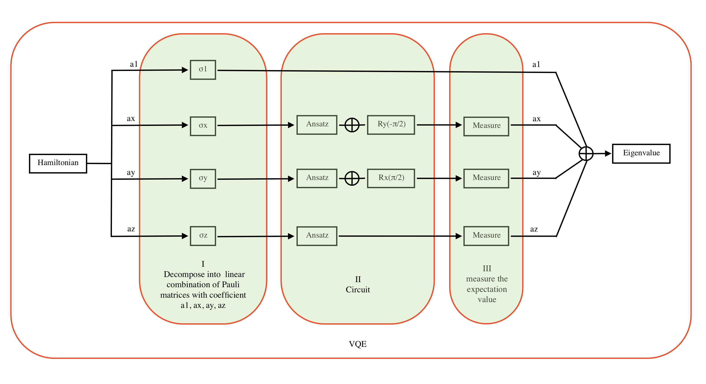

# VQE
Finding lowest Eigenvalue for given Two-Qubit Hamiltonian using VQE-like circuits

# Task 4 
Hamiltonian (H):
$$ H = \begin{vmatrix}
1 & 0 & 0 & 0\\
0 & 0 & -1 & 0\\
0 & -1 & 0 & 0\\
0 & 0 & 0 & 1
\end{vmatrix} $$

## Variational quantum eigensolver

It works on variational principal which say if we have a Hamiltonian H with eigenstates and associated eigenvalues . Then the following relation holds: $$ H |\psi⟩ = \lambda|\psi⟩$$ 
where λ is energy value for given state |ψ⟩. for every different |ψ⟩ we can find its energy, but for only one 
|ψ⟩ there exist λ which is smallest of all, and we call that |ψ⟩ as groung state of the system. and VQE helps us to find groung state of any given system. to make process simpler it decompose Hamiltonians into Pauli-Matrices.  [Resourse](https://www.mustythoughts.com/variational-quantum-eigensolver-explained)

   

VQE can be sum up in three parts 
1. Decomposition
2. Circuit
    - Ansatz
    - Initializing mesurement basis
3. Measurement
 
 
